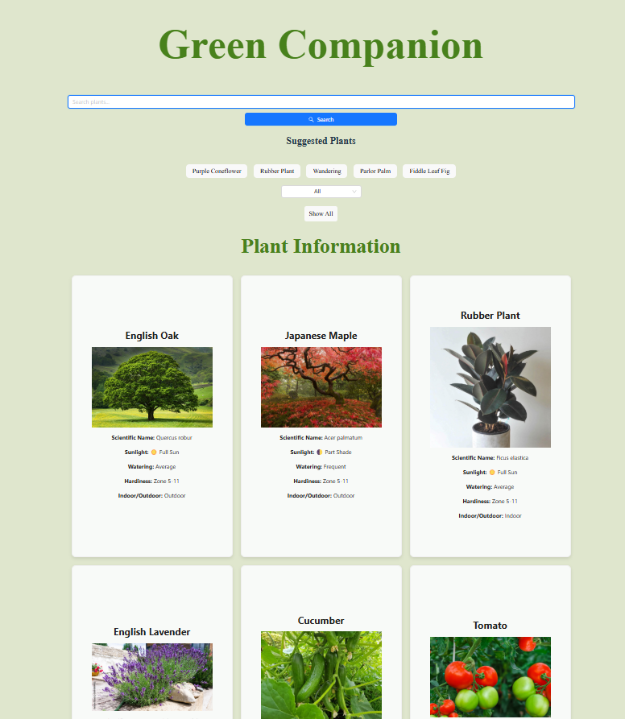

# Green Companion 🌱

**Green Companion** is a plant information app designed to help users explore various plants, view detailed information, and discover new suggestions. It provides a user-friendly interface with a search bar, suggested plants, and individual plant cards to make plant discovery easy and enjoyable.

---

## Features 🌟

- **Search Plants**: Quickly find plants by their common name using the search bar.
- **Suggested Plants**: Displays five random plant suggestions to help users discover new options.
- **Plant Cards**: Shows detailed information about each plant, including its name and image.
- **Responsive Design**: Works seamlessly on different screen sizes for an enjoyable user experience.

---

## Demo 🖥️

  
*A clean and interactive UI for plant lovers!*

---

## Technologies Used 🛠️

- **React**: Core framework for building the app.
- **CSS**: Custom styling for components.
- **JavaScript**: Logic for filtering plants and handling interactions.

---

## How It Works ⚙️

1. **Plant Data**: The app uses predefined plant data from a local file (`data.js`).
2. **Search**: Users can type a plant name in the search bar to filter results dynamically.
3. **Suggested Plants**: Randomly selects 5 plants to display as suggestions.
4. **Plant Selection**: Clicking on a suggested plant will update the displayed plant card with its details.

---

